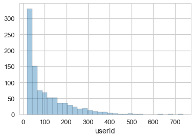
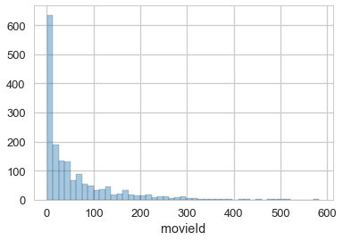
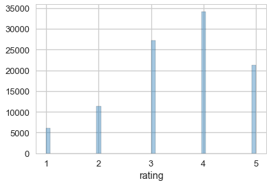

```python
import pandas as pd
import numpy as np

import matplotlib.pyplot as plt
import seaborn as sns
from matplotlib import rcParams

sns.set_context("talk")
sns.set_style("whitegrid")
rcParams['patch.force_edgecolor'] = True
%matplotlib inline 
```


```python
ratings =  pd.read_csv('ml-100k/u.data', sep='\t',  header=0, 
                       names=['userId', 'movieId', 'rating','timestamp'], engine='python').astype(int)
ratings.head()
```


<div>
<style>
    .dataframe thead tr:only-child th {
        text-align: right;
    }

    .dataframe thead th {
        text-align: left;
    }

    .dataframe tbody tr th {
        vertical-align: top;
    }
</style>
<table border="1" class="dataframe">
  <thead>
    <tr style="text-align: right;">
      <th></th>
      <th>userId</th>
      <th>movieId</th>
      <th>rating</th>
      <th>timestamp</th>
    </tr>
  </thead>
  <tbody>
    <tr>
      <th>0</th>
      <td>186</td>
      <td>302</td>
      <td>3</td>
      <td>891717742</td>
    </tr>
    <tr>
      <th>1</th>
      <td>22</td>
      <td>377</td>
      <td>1</td>
      <td>878887116</td>
    </tr>
    <tr>
      <th>2</th>
      <td>244</td>
      <td>51</td>
      <td>2</td>
      <td>880606923</td>
    </tr>
    <tr>
      <th>3</th>
      <td>166</td>
      <td>346</td>
      <td>1</td>
      <td>886397596</td>
    </tr>
    <tr>
      <th>4</th>
      <td>298</td>
      <td>474</td>
      <td>4</td>
      <td>884182806</td>
    </tr>
  </tbody>
</table>
</div>


```python
ratings['userId'].value_counts().describe()
```


    count    943.000000
    mean     106.043478
    std      100.932453
    min       20.000000
    25%       33.000000
    50%       65.000000
    75%      148.000000
    max      737.000000
    Name: userId, dtype: float64


```python
sns.distplot(ratings['userId'].value_counts(), kde=False)
```


    <matplotlib.axes._subplots.AxesSubplot at 0x112d2ae48>





```python
ratings['movieId'].value_counts().describe()
```


    count    1682.000000
    mean       59.452438
    std        80.383423
    min         1.000000
    25%         6.000000
    50%        27.000000
    75%        80.000000
    max       583.000000
    Name: movieId, dtype: float64


```python
sns.distplot(ratings['movieId'].value_counts(), kde=False)
```


    <matplotlib.axes._subplots.AxesSubplot at 0x1147cd438>





```python
ratings['rating'].describe()
```


    count    99999.000000
    mean         3.529865
    std          1.125678
    min          1.000000
    25%          3.000000
    50%          4.000000
    75%          4.000000
    max          5.000000
    Name: rating, dtype: float64


```python
sns.distplot(ratings['rating'], kde=False)
```


    <matplotlib.axes._subplots.AxesSubplot at 0x10590d048>




